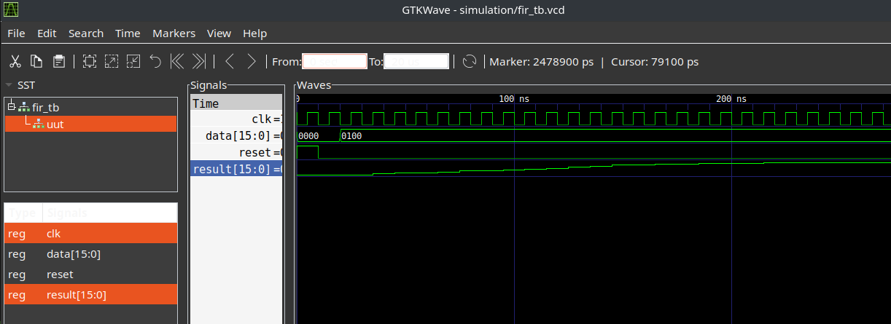

# FIR Filter

file structure:
```
.
├── fir.md
├── makefile
├── source
│   ├── fir_common.vhd
│   └── fir.vhd
└── testbench
    └── fir_tb.vhd
```
---
## Features of the fir filter

1. The taps of the filter is parameterized through the generic map of the design.
2. And the coefficients of the filter should be passed through the port interface.
3. The testbench provided uses 20 taps. The coefficients of the testbench are generated by a Matlab script.

---
## How to run the testbench
The current setup uses GDL and makefile to run the simulation, therefore you would only need to run the command below to execute the simulation:
```
make TESTBENCH=fir
```
and you will see the outputs from your terminal:
```
$ make TESTBENCH=fir
testbench/fir_tb.vhd:71:13:@0ms:(report note): ======Tests start======
testbench/fir_tb.vhd:97:13:@320ns:(report note): ======Tests finished======
testbench/fir_tb.vhd:98:13:@320ns:(report note): Please check the output message.
/usr/bin/ghdl-mcode:info: simulation stopped by --stop-time @20us
```
Besides, the wave form can be shown in the GTK-Wave like:

Above is an example of testing the filter's step response.