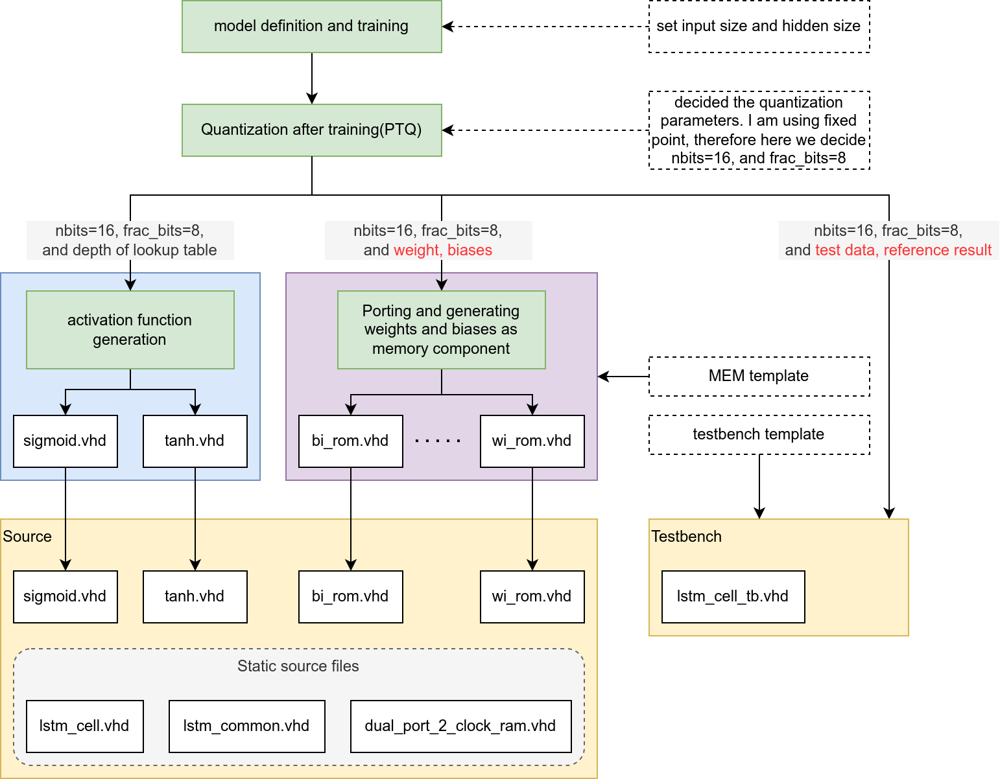

# LSTM cell based on a template

file structure:
```
.
├── lstm.md
├── source
│   ├── bf_rom.vhd
│   ├── bg_rom.vhd
│   ├── bi_rom.vhd
│   ├── bo_rom.vhd
│   ├── dual_port_2_clock_ram.vhd
│   ├── lstm_cell.vhd
│   ├── lstm_common.vhd
│   ├── sigmoid.vhd
│   ├── tanh.vhd
│   ├── wf_rom.vhd
│   ├── wg_rom.vhd
│   ├── wi_rom.vhd
│   └── wo_rom.vhd
└── testbench
    └── lstm_cell_tb.vhd
```
## Why do I call it a template based approach?

1. The core component `lstm_cell` is designed in a way that at the AI application developer doesn't have to change anything in it.
2. Weights and bias are implemented in memory components, which are named as `xx_rom.vhd`. `xx` is replaced by `bf`, `bg` and so on. Such components also come from a  template(`rom_template.vhd`), and just part of the content was replaced between each component.
3. The LSTM cell requires activation functions(such as sigmoid.vhd, and tanh.vhd). The user/creator should generate these files and include them in the `work` library.
   
4. `dual_port_2_clock_ram.vhd` and `lstm_cell.vhd` and `lstm_common.vhd` is designed to be scalable, so the AI developer doesn't need to change it.
   
---

## Workflow for generating a customed/trained lstm cell
The chart below shows how to generate a lstm_cell with parameters


First of all, for the activation functions, the `sigmoid_gen.py` and `tanh_gen.py` can generate the condition statements in VHDL format. Then you should replace the condition statements in the `.vhd`, and change the component interface according to `nbits`. **Note: the current implementation uses lookup table for activation functions, the entries of each lookup table should be fewer than 512. For input range of sigmoid, could be -2.5 to 2.5, while the input range of tanh could be -1 to 1.** (The range selection is followed in [this paper](https://doi.org/10.1109/SmartCloud.2018.00009)).

For generating the memories to store weights and biases, `lstm_test_data_gen.ipynb` provides examples of how I restructure the weights/biases from **pytorch** and reformat them to **vhdl style string**. Such **vhdl style string** can be copied to associated template for a memory component is in `templates/rom_template.vhd`.

Finally, the generated source code can be tested with a testbench(`testbench/lstm_cell_tb.vhd`). However several things you might have to check:
- According to your configuration, e.g, `input_size` or `hidden_size` or `quantization configuration` of the lstm_cell, check/changed the generic part of the `lstm_cell_tb` :
``` vhdl
entity lstm_cell_tb is
    generic (
        DATA_WIDTH  : integer := 16;    -- that fixed point data has 16bits
        FRAC_WIDTH  : integer := 8;     -- and 8bits is for the factional part

        INPUT_SIZE  : integer := 5;     -- same as input_size of the lstm_cell in PyTorch
        HIDDEN_SIZE : integer := 20;     -- same as hidden_size of the lstm_cell in PyTorch

        X_H_ADDR_WIDTH : integer := 5;  -- equals to ceil(log2(input_size+hidden_size))
        HIDDEN_ADDR_WIDTH  : integer := 5; -- equals to ceil(log2(input_size))
        W_ADDR_WIDTH : integer := 9     -- equals to ceil(log2((input_size+hidden_size)*hidden_size))
    );
    port ( clk: out std_logic);
end lstm_cell_tb; 
```

- The code block below, it provides test data may need to be changed:
``` vhdl
    type X_H_ARRAY is array (0 to 31) of signed(16-1 downto 0);
    type C_ARRAY is array (0 to 31) of signed(16-1 downto 0); -- The lengths(32 elements) of the two arrays are equal only by coincidence

    signal test_x_h_data : X_H_ARRAY :=  (x"018a",x"ffb5",x"fdd3",x"0091",x"feeb",x"0099",x"fe72",x"ffa9",x"01da",x"ffc9",x"ff42",x"0090",x"0042",x"ffd4",x"ff53",x"00f0",x"007d",x"0134",x"0015",x"fecd",x"ffff",x"ff7c",x"ffb2",x"fe6c",x"01b4",x"0000",x"0000",x"0000",x"0000",x"0000",x"0000",x"0000");

    signal test_c_data : C_ARRAY :=  (x"0034",x"ff8d",x"ff6e",x"ff72",x"fee0",x"ffaf",x"fee9",x"ffeb",x"ffe9",x"00af",x"ff2a",x"0000",x"ff40",x"002f",x"009f",x"00a3",x"ffc2",x"024d",x"fe1f",x"fff4",x"0000",x"0000",x"0000",x"0000",x"0000",x"0000",x"0000",x"0000",x"0000",x"0000",x"0000",x"0000");
```
The example of how to generate codes for this block is demonstrated in `lstm_test_data_gen.ipynb`.

## How to run the testbench
The current setup uses GDL and makefile to run the simulation, therefore you would only need to run the command below to execute the simulation:
```
make TESTBENCH=lstm_cell
```
and you will get the output like below:
```
testbench/lstm_cell_tb.vhd:159:13:@0ms:(report note): ======Tests start======
testbench/lstm_cell_tb.vhd:187:17:@11645ns:(report note): The value of h_out(0) is 40
testbench/lstm_cell_tb.vhd:187:17:@11665ns:(report note): The value of h_out(1) is -71
testbench/lstm_cell_tb.vhd:187:17:@11685ns:(report note): The value of h_out(2) is -29
testbench/lstm_cell_tb.vhd:187:17:@11705ns:(report note): The value of h_out(3) is -15
testbench/lstm_cell_tb.vhd:187:17:@11725ns:(report note): The value of h_out(4) is -82
testbench/lstm_cell_tb.vhd:187:17:@11745ns:(report note): The value of h_out(5) is 18
testbench/lstm_cell_tb.vhd:187:17:@11765ns:(report note): The value of h_out(6) is -53
testbench/lstm_cell_tb.vhd:187:17:@11785ns:(report note): The value of h_out(7) is 8
testbench/lstm_cell_tb.vhd:187:17:@11805ns:(report note): The value of h_out(8) is -9
testbench/lstm_cell_tb.vhd:187:17:@11825ns:(report note): The value of h_out(9) is 24
testbench/lstm_cell_tb.vhd:187:17:@11845ns:(report note): The value of h_out(10) is -28
testbench/lstm_cell_tb.vhd:187:17:@11865ns:(report note): The value of h_out(11) is 51
testbench/lstm_cell_tb.vhd:187:17:@11885ns:(report note): The value of h_out(12) is -66
testbench/lstm_cell_tb.vhd:187:17:@11905ns:(report note): The value of h_out(13) is 19
testbench/lstm_cell_tb.vhd:187:17:@11925ns:(report note): The value of h_out(14) is 75
testbench/lstm_cell_tb.vhd:187:17:@11945ns:(report note): The value of h_out(15) is 31
testbench/lstm_cell_tb.vhd:187:17:@11965ns:(report note): The value of h_out(16) is 18
testbench/lstm_cell_tb.vhd:187:17:@11985ns:(report note): The value of h_out(17) is 115
testbench/lstm_cell_tb.vhd:187:17:@12005ns:(report note): The value of h_out(18) is -147
testbench/lstm_cell_tb.vhd:187:17:@12025ns:(report note): The value of h_out(19) is 11
testbench/lstm_cell_tb.vhd:192:13:@12125ns:(report note): ======Tests finished======
testbench/lstm_cell_tb.vhd:193:13:@12125ns:(report note): Please check the output message.
/usr/bin/ghdl-mcode:info: simulation stopped by --stop-time @20us
```